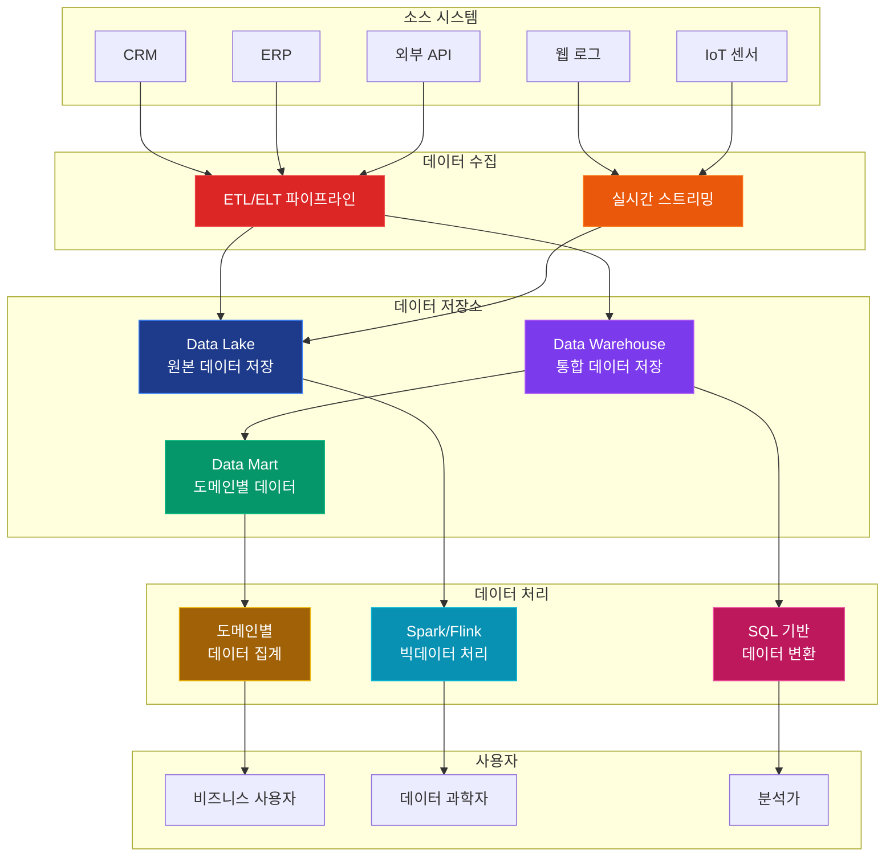

# 데이터 아키텍처 가이드

이 문서는 현대 기업의 데이터 전략에서 핵심이 되는 세 가지 데이터 아키텍처에 대한 포괄적인 가이드를 제공합니다.

## 데이터 아키텍처 관계도

## 주요 문서

### 1. [Data Mart](./posts/data-architecture/data-mart.md)
특정 부서나 팀을 위한 맞춤형 데이터 저장소입니다. 마케팅팀, 영업팀 등 각 부서의 필요에 맞게 데이터를 정리해놓은 곳이라고 생각하시면 됩니다.

**쉽게 설명하면:**
- 각 부서별로 필요한 데이터만 따로 모아둔 창고
- 빠르고 간단하게 데이터를 찾을 수 있음
- 부서별로 다른 형태로 데이터를 정리할 수 있음

### 2. [Data Warehouse](./posts/data-architecture/data-warehouse.md)
회사의 모든 데이터를 한 곳에 모아서 관리하는 중앙 창고입니다. 의사결정에 필요한 모든 정보를 체계적으로 정리해놓은 곳입니다.

**쉽게 설명하면:**
- 회사의 모든 데이터를 모아둔 큰 창고
- 데이터의 품질과 일관성을 보장
- 전사적인 분석과 보고서 작성에 사용

### 3. [Data Lake](./posts/data-architecture/data-lake.md)
원본 데이터를 그대로 보관하는 거대한 호수입니다. 구조화되지 않은 데이터도 포함하여 나중에 다양한 용도로 활용할 수 있도록 저장합니다.

**쉽게 설명하면:**
- 모든 원본 데이터를 그대로 보관하는 호수
- 나중에 어떻게 쓸지 모르는 데이터도 일단 저장
- 머신러닝이나 빅데이터 분석에 유용

### 4. [데이터 아키텍처 비교](./posts/data-architecture/data-architecture-comparison.md)
세 가지 데이터 저장 방식의 차이점과 언제 어떤 것을 사용해야 하는지 비교 분석한 가이드입니다.

**쉽게 설명하면:**
- 세 가지 방식의 장단점 비교
- 상황별로 어떤 방식을 선택해야 하는지 안내
- 실제 구현 시 고려사항들

## 빠른 참조

### 언제 어떤 아키텍처를 선택해야 할까요?

| 상황 | 추천 아키텍처 | 이유 |
|------|---------------|------|
| 특정 부서 분석 | **Data Mart** | 빠른 구현, 도메인 특화 |
| 전사적 통합 분석 | **Data Warehouse** | 중앙 집중식 관리, 데이터 품질 |
| 빅데이터/ML | **Data Lake** | 다양한 데이터 형식, 확장성 |
| 복잡한 요구사항 | **하이브리드** | 각 아키텍처의 장점 결합 |

### 기술 스택 비교

| 구분 | Data Mart | Data Warehouse | Data Lake |
|------|-----------|----------------|-----------|
| **데이터베이스** | PostgreSQL, MySQL | Redshift, Snowflake | S3, HDFS |
| **처리** | 간단한 ETL | 복잡한 ETL | Spark, Flink |
| **쿼리** | SQL | SQL | Hive, Presto |

## 데이터 엔지니어링 도구

### 1. [Dagster 기초](./posts/data-engineering/dagster-basics.md)
데이터 파이프라인을 자동으로 관리해주는 도구입니다. 데이터가 어디서 와서 어디로 가는지, 언제 처리해야 하는지를 자동으로 조정해줍니다.

**쉽게 설명하면:**
- 데이터 작업을 자동화해주는 관리자
- 데이터 흐름을 시각적으로 보여줌
- 문제가 생기면 알려주고 자동으로 복구

### 2. [DBT 기초](./posts/data-engineering/dbt-basics.md)
데이터를 변환하고 정리하는 SQL 기반 도구입니다. 복잡한 데이터 처리 작업을 SQL로 쉽게 할 수 있게 해줍니다.

**쉽게 설명하면:**
- SQL로 데이터를 정리하고 변환하는 도구
- 데이터 품질을 자동으로 검사
- 문서화와 버전 관리를 자동으로 해줌

### 3. [Dagster와 DBT 통합 아키텍처](./posts/data-engineering/data-mart-dagster-architecture.md)
Dagster와 DBT를 함께 사용해서 데이터 마트를 구축하는 방법을 설명합니다.

**쉽게 설명하면:**
- 두 도구를 함께 사용하는 방법
- 실제 프로젝트에서 어떻게 적용하는지
- 모니터링과 관리 방법

---

*이 문서들은 지속적으로 업데이트되며, 최신 데이터 아키텍처 트렌드와 모범 사례를 반영합니다.*