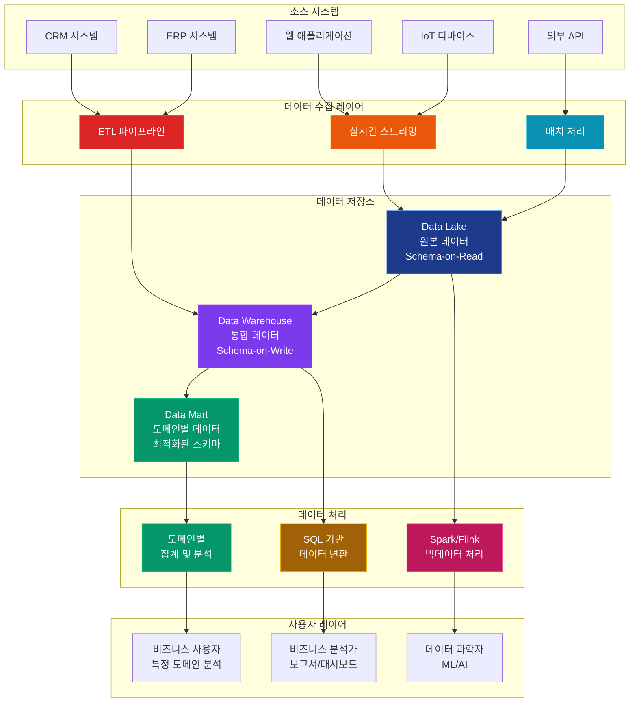
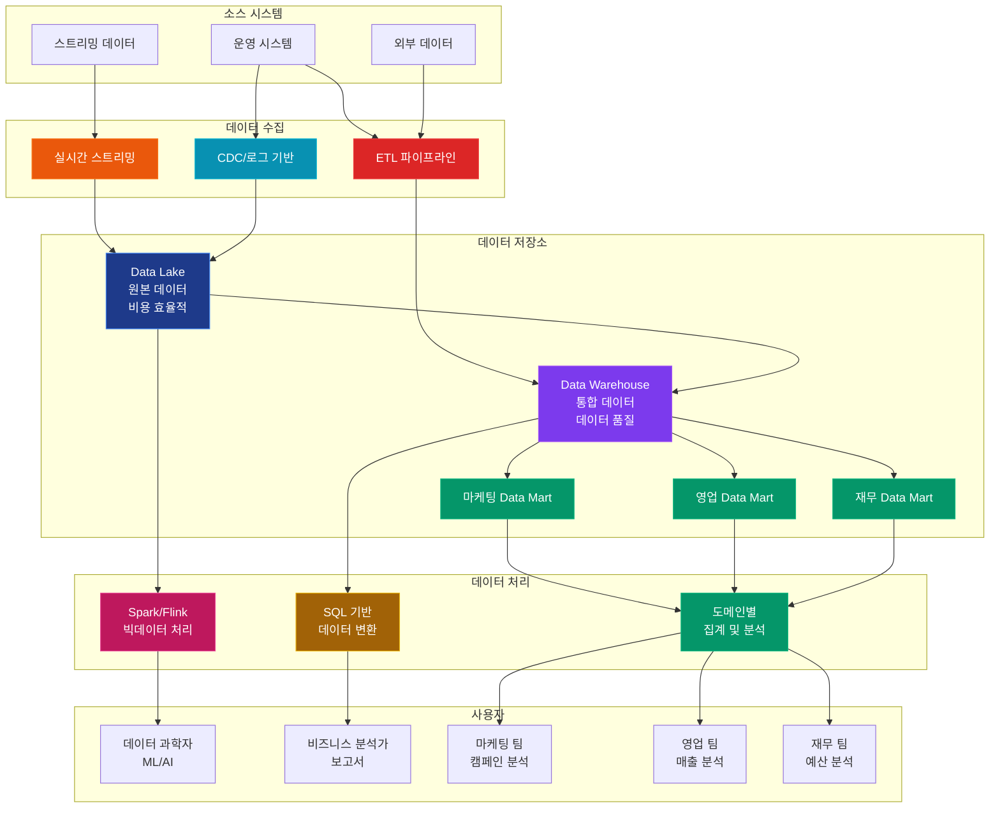

# 데이터 아키텍처 비교: Data Mart vs Data Warehouse vs Data Lake

## 개요

현대 기업의 데이터 전략에서 Data Mart, Data Warehouse, Data Lake는 각각 다른 역할과 목적을 가지고 있습니다. 이 문서에서는 세 가지 아키텍처의 특징, 장단점, 사용 사례를 비교 분석합니다.

## 데이터 아키텍처 관계 및 플로우



## 기본 개념 비교

| 구분 | Data Mart | Data Warehouse | Data Lake |
|------|-----------|----------------|-----------|
| **정의** | 특정 부서/도메인용 데이터 저장소 | 중앙 집중식 데이터 저장소 | 원본 데이터 저장소 |
| **범위** | 제한적 (특정 도메인) | 전사적 | 전사적 |
| **데이터 형식** | 구조화된 데이터 | 구조화된 데이터 | 구조화/비구조화/반구조화 |
| **스키마** | 미리 정의된 스키마 | 미리 정의된 스키마 | Schema-on-Read |

## 아키텍처 비교

### Data Mart
```
소스 시스템 → ETL → Data Mart → 사용자
```
- 특정 부서나 도메인에 특화
- 단순한 구조
- 빠른 쿼리 성능

### Data Warehouse
```
소스 시스템 → ETL → Data Warehouse → Data Marts → 사용자
```
- 중앙 집중식 데이터 관리
- 복잡한 아키텍처
- 통합된 데이터 소스

### Data Lake
```
소스 시스템 → Data Lake → 처리/분석 → 사용자
```
- 원본 데이터 보존
- 유연한 구조
- 다양한 데이터 형식

## 상세 비교 분석

### 1. 데이터 처리 방식

#### Data Mart
- **Schema-on-Write**: 데이터 저장 시 스키마 정의
- **정규화된 구조**: 최적화된 테이블 구조
- **도메인 특화**: 특정 비즈니스 영역에 최적화

#### Data Warehouse
- **Schema-on-Write**: 데이터 저장 시 스키마 정의
- **정규화/차원 모델**: 다양한 모델링 방식
- **통합된 구조**: 전사적 데이터 통합

#### Data Lake
- **Schema-on-Read**: 분석 시점에 스키마 정의
- **원본 데이터**: 변환 없이 원시 데이터 저장
- **유연한 구조**: 다양한 데이터 형식 지원

### 2. 성능 특성

| 구분 | Data Mart | Data Warehouse | Data Lake |
|------|-----------|----------------|-----------|
| **쿼리 성능** | 매우 빠름 | 빠름 | 상대적으로 느림 |
| **처리 용량** | 제한적 | 대용량 | 대용량 |
| **실시간성** | 실시간 가능 | 배치 중심 | 실시간/배치 |
| **확장성** | 제한적 | 높음 | 매우 높음 |

### 3. 비용 구조

#### Data Mart
- **초기 비용**: 낮음
- **운영 비용**: 낮음
- **확장 비용**: 높음 (여러 개 구축 시)

#### Data Warehouse
- **초기 비용**: 높음
- **운영 비용**: 중간
- **확장 비용**: 중간

#### Data Lake
- **초기 비용**: 중간
- **운영 비용**: 낮음
- **확장 비용**: 낮음

## 사용 사례별 선택 가이드

### 1. 부서별 특화 분석
**추천: Data Mart**
- 마케팅 부서의 캠페인 분석
- 영업 부서의 지역별 매출 분석
- 재무 부서의 예산 분석

**이유:**
- 빠른 구현 가능
- 특정 도메인에 최적화
- 비용 효율적

### 2. 전사적 통합 분석
**추천: Data Warehouse**
- 전사적 KPI 대시보드
- 크로스 도메인 분석
- 규정 준수 및 감사

**이유:**
- 중앙 집중식 데이터 관리
- 일관된 데이터 소스
- 데이터 품질 보장

### 3. 빅데이터 및 머신러닝
**추천: Data Lake**
- 대용량 로그 분석
- 머신러닝 모델 훈련
- 실시간 스트리밍 분석

**이유:**
- 다양한 데이터 형식 지원
- 확장성
- 실험 가능성

### 4. 하이브리드 접근
**추천: Data Lake + Data Warehouse**
- 복잡한 데이터 전략
- 다양한 사용자 요구사항
- 단계적 마이그레이션

## 구현 복잡도

### Data Mart
- **구축 시간**: 1-3개월
- **기술 복잡도**: 낮음
- **운영 복잡도**: 낮음
- **필요한 전문성**: 중간

### Data Warehouse
- **구축 시간**: 6-18개월
- **기술 복잡도**: 높음
- **운영 복잡도**: 높음
- **필요한 전문성**: 높음

### Data Lake
- **구축 시간**: 3-12개월
- **기술 복잡도**: 높음
- **운영 복잡도**: 높음
- **필요한 전문성**: 높음

## 기술 스택 비교

### Data Mart
- **데이터베이스**: PostgreSQL, MySQL, SQL Server
- **ETL**: 간단한 스크립트, Apache Airflow
- **시각화**: Tableau, Power BI

### Data Warehouse
- **데이터베이스**: Amazon Redshift, Snowflake, BigQuery
- **ETL**: Apache Airflow, Talend, Informatica
- **시각화**: Tableau, Power BI, QlikView

### Data Lake
- **스토리지**: Amazon S3, Azure Data Lake, HDFS
- **처리**: Apache Spark, Apache Flink
- **쿼리**: Apache Hive, Presto, Athena

## 데이터 품질 및 거버넌스

### Data Mart
- **데이터 품질**: 중간 (도메인 특화)
- **거버넌스**: 단순
- **메타데이터**: 제한적

### Data Warehouse
- **데이터 품질**: 높음 (중앙 집중식)
- **거버넌스**: 복잡
- **메타데이터**: 포괄적

### Data Lake
- **데이터 품질**: 낮음 (원본 데이터)
- **거버넌스**: 복잡
- **메타데이터**: 중요

## 보안 및 규정 준수

### Data Mart
- **보안 수준**: 중간
- **규정 준수**: 도메인별
- **접근 제어**: 단순

### Data Warehouse
- **보안 수준**: 높음
- **규정 준수**: 전사적
- **접근 제어**: 복잡

### Data Lake
- **보안 수준**: 높음 (복잡성)
- **규정 준수**: 전사적
- **접근 제어**: 복잡

## 선택 기준 체크리스트

### Data Mart 선택 시 고려사항
- [ ] 특정 부서나 도메인에 특화된 분석이 필요한가?
- [ ] 빠른 구현이 우선순위인가?
- [ ] 비용이 제약 요소인가?
- [ ] 복잡한 통합이 필요하지 않은가?

### Data Warehouse 선택 시 고려사항
- [ ] 전사적 통합 분석이 필요한가?
- [ ] 데이터 품질이 중요한가?
- [ ] 규정 준수가 중요한가?
- [ ] 장기적인 투자가 가능한가?

### Data Lake 선택 시 고려사항
- [ ] 다양한 데이터 형식을 처리해야 하는가?
- [ ] 머신러닝이나 빅데이터 분석이 필요한가?
- [ ] 실시간 처리가 필요한가?
- [ ] 확장성이 중요한가?

## 최신 트렌드

### 1. Lakehouse 아키텍처
- Data Lake와 Data Warehouse의 장점 결합
- ACID 트랜잭션 지원
- 통합된 데이터 플랫폼

### 2. Data Mesh
- 분산 데이터 아키텍처
- 도메인 중심 설계
- 자율적 데이터 제품

### 3. 실시간 데이터 처리
- 스트리밍 데이터 처리
- 실시간 분석
- 이벤트 기반 아키텍처

## 하이브리드 아키텍처 패턴



## 결론 및 권장사항

### 단계적 접근
1. **초기 단계**: Data Mart로 시작
2. **성장 단계**: Data Warehouse 구축
3. **고급 단계**: Data Lake 추가

### 하이브리드 전략
- **운영 데이터**: Data Warehouse
- **분석 데이터**: Data Mart
- **원본 데이터**: Data Lake

### 성공 요인
1. **명확한 요구사항 정의**
2. **적절한 기술 스택 선택**
3. **체계적인 데이터 거버넌스**
4. **지속적인 모니터링 및 최적화**

각 아키텍처는 고유한 장단점을 가지고 있으며, 기업의 요구사항과 상황에 맞는 적절한 선택이 중요합니다. 많은 경우 하이브리드 접근이 최적의 솔루션이 될 수 있습니다. 