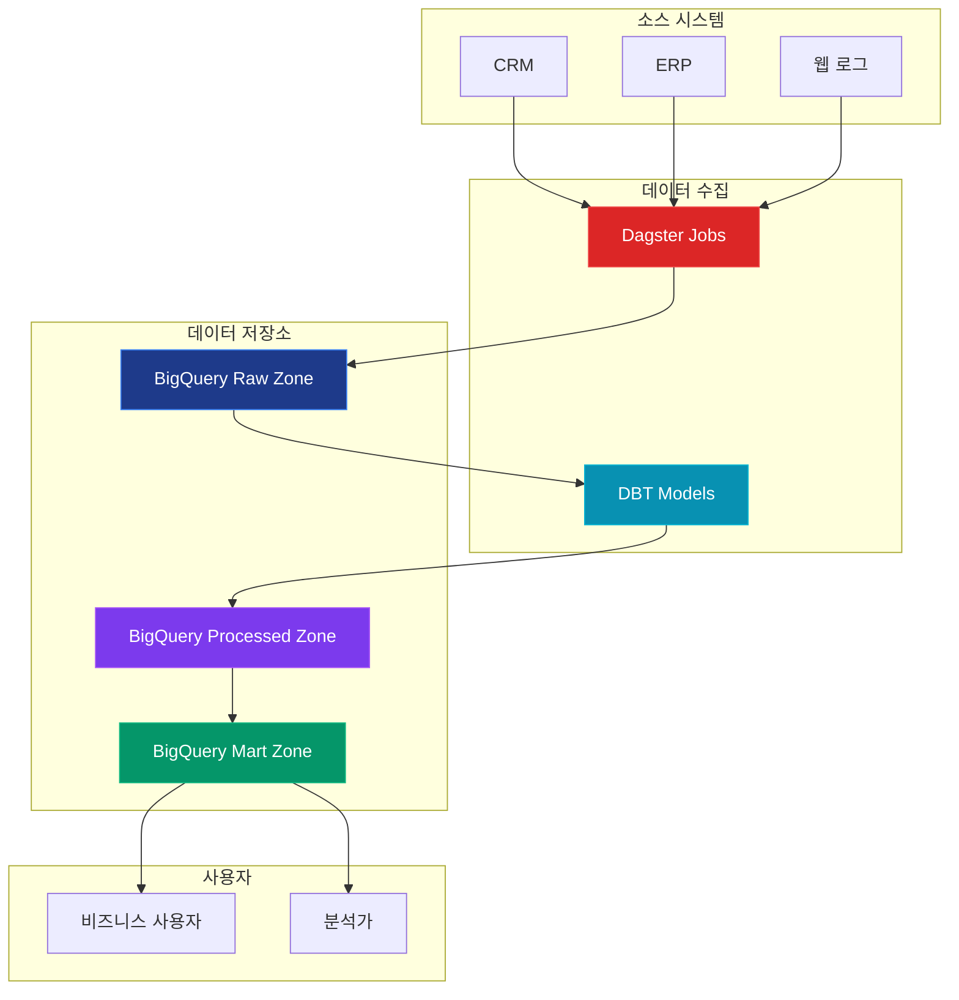

# Data Mart

## 개요

Data Mart는 특정 부서나 팀을 위한 맞춤형 데이터 저장소입니다. 쉽게 말해서, 각 부서가 필요로 하는 데이터만 따로 모아둔 작은 창고라고 생각하시면 됩니다.

**예시**
- 마케팅팀을 위한 마케팅 데이터 창고
- 영업팀을 위한 영업 데이터 창고  
- 재무팀을 위한 재무 데이터 창고

각 부서는 자신에게 필요한 데이터만 빠르게 찾아서 사용할 수 있습니다.

## 특징

### 1. 특화된 목적
- 특정 부서나 비즈니스 영역에 특화
- 마케팅, 판매, 재무 등 특정 도메인에 집중
- 사용자 친화적인 구조

### 2. 빠른 접근성
- 소규모 데이터셋으로 빠른 쿼리 성능
- 최적화된 인덱싱
- 실시간 분석 가능

### 3. 단순한 구조
- 정규화된 스키마
- 직관적인 테이블 구조
- 쉬운 이해와 사용

## 사용 사례

### 1. 부서별 분석
- 마케팅 부서의 캠페인 성과 분석
- 영업 부서의 지역별 매출 분석
- 재무 부서의 예산 대비 실적 분석

### 2. 실시간 모니터링
- KPI 대시보드
- 실시간 성과 지표
- 알림 시스템

### 3. 특정 프로세스 분석
- 고객 여정 분석
- 제품 생명주기 추적
- 공급망 최적화

## 장점

1. **빠른 구현**: 복잡한 Data Warehouse보다 빠른 구축
2. **비용 효율성**: 소규모 투자로 시작 가능
3. **사용자 친화적**: 특정 도메인에 최적화된 구조
4. **높은 성능**: 최적화된 쿼리 성능
5. **유연성**: 요구사항 변화에 빠른 대응

## 단점

1. **데이터 중복**: 여러 Data Mart 간 데이터 중복 가능
2. **일관성 문제**: 독립적 운영으로 인한 데이터 불일치
3. **확장성 제한**: 대규모 데이터 처리 시 한계
4. **복잡성 증가**: Data Mart 수 증가 시 관리 복잡성

## 데이터 모델링 패턴: SRC → FCT → MART

Data Mart의 데이터 모델링은 일반적으로 세 단계로 구성됩니다: SRC(Source), FCT(Fact), MART(Mart) 단계입니다.

### 1. SRC (Source) 단계
소스 시스템에서 추출한 원본 데이터를 저장하는 단계입니다.

#### 특징
- **원본 데이터 보존**: 소스 시스템의 데이터를 그대로 저장
- **변환 최소화**: 데이터 변환 없이 원본 형태 유지
- **히스토리 관리**: 데이터 변경 이력 추적
- **데이터 품질 검증**: 기본적인 데이터 검증 수행

#### 테이블 구조 예시
```sql
-- 고객 소스 테이블
CREATE TABLE src_customer (
    customer_id VARCHAR(50),
    customer_name VARCHAR(100),
    email VARCHAR(255),
    phone VARCHAR(20),
    address TEXT,
    created_date TIMESTAMP,
    updated_date TIMESTAMP,
    source_system VARCHAR(50),
    batch_id VARCHAR(50)
);

-- 주문 소스 테이블
CREATE TABLE src_order (
    order_id VARCHAR(50),
    customer_id VARCHAR(50),
    product_id VARCHAR(50),
    quantity INTEGER,
    unit_price DECIMAL(10,2),
    order_date TIMESTAMP,
    status VARCHAR(20),
    source_system VARCHAR(50),
    batch_id VARCHAR(50)
);
```

#### 구현 고려사항
- **데이터 타입 매핑**: 소스 시스템의 데이터 타입을 Data Mart에 맞게 변환
- **NULL 처리**: NULL 값에 대한 일관된 처리 방안
- **중복 제거**: 동일한 데이터의 중복 처리
- **에러 처리**: 데이터 오류 시 처리 방안

### 2. FCT (Fact) 단계
비즈니스 이벤트나 거래를 나타내는 팩트 테이블을 구성하는 단계입니다.

#### 특징
- **이벤트 중심**: 비즈니스 이벤트나 거래를 중심으로 구성
- **수치 데이터**: 측정 가능한 수치 데이터 저장
- **차원 키**: 차원 테이블과의 연결을 위한 외래 키
- **집계 가능**: 다양한 수준의 집계 분석 지원

#### 테이블 구조 예시
```sql
-- 판매 팩트 테이블
CREATE TABLE fct_sales (
    sales_key BIGINT PRIMARY KEY,
    customer_key INTEGER,
    product_key INTEGER,
    date_key INTEGER,
    store_key INTEGER,
    sales_quantity INTEGER,
    sales_amount DECIMAL(12,2),
    cost_amount DECIMAL(12,2),
    profit_amount DECIMAL(12,2),
    created_date TIMESTAMP DEFAULT CURRENT_TIMESTAMP
);

-- 고객 팩트 테이블
CREATE TABLE fct_customer_activity (
    activity_key BIGINT PRIMARY KEY,
    customer_key INTEGER,
    date_key INTEGER,
    login_count INTEGER,
    purchase_count INTEGER,
    total_spent DECIMAL(12,2),
    created_date TIMESTAMP DEFAULT CURRENT_TIMESTAMP
);
```

#### 차원 테이블 예시
```sql
-- 고객 차원 테이블
CREATE TABLE dim_customer (
    customer_key INTEGER PRIMARY KEY,
    customer_id VARCHAR(50),
    customer_name VARCHAR(100),
    customer_segment VARCHAR(50),
    region VARCHAR(100),
    city VARCHAR(100),
    country VARCHAR(100),
    effective_date DATE,
    expiry_date DATE,
    is_current BOOLEAN DEFAULT TRUE
);

-- 제품 차원 테이블
CREATE TABLE dim_product (
    product_key INTEGER PRIMARY KEY,
    product_id VARCHAR(50),
    product_name VARCHAR(200),
    category VARCHAR(100),
    subcategory VARCHAR(100),
    brand VARCHAR(100),
    effective_date DATE,
    expiry_date DATE,
    is_current BOOLEAN DEFAULT TRUE
);
```

#### 구현 고려사항
- **서로게이트 키**: 차원 테이블의 고유 식별자 생성
- **SCD (Slowly Changing Dimension)**: 차원 데이터 변경 이력 관리
- **팩트 테이블 정규화**: 중복 제거 및 성능 최적화
- **인덱싱 전략**: 조인 성능 향상을 위한 인덱스 설계

### 3. MART (Mart) 단계
최종 사용자를 위한 분석용 테이블을 구성하는 단계입니다.

#### 특징
- **사용자 친화적**: 비즈니스 사용자가 쉽게 이해할 수 있는 구조
- **미리 집계**: 자주 사용되는 집계 데이터 미리 계산
- **성능 최적화**: 빠른 쿼리 성능을 위한 최적화
- **도메인 특화**: 특정 비즈니스 영역에 특화된 구조

#### 테이블 구조 예시
```sql
-- 일별 판매 마트 테이블
CREATE TABLE mart_daily_sales (
    date_key INTEGER PRIMARY KEY,
    sales_date DATE,
    total_sales_amount DECIMAL(12,2),
    total_sales_quantity INTEGER,
    total_customers INTEGER,
    total_orders INTEGER,
    avg_order_value DECIMAL(10,2),
    created_date TIMESTAMP DEFAULT CURRENT_TIMESTAMP
);

-- 고객별 판매 마트 테이블
CREATE TABLE mart_customer_sales (
    customer_key INTEGER,
    customer_id VARCHAR(50),
    customer_name VARCHAR(100),
    customer_segment VARCHAR(50),
    total_purchase_amount DECIMAL(12,2),
    total_purchase_count INTEGER,
    first_purchase_date DATE,
    last_purchase_date DATE,
    avg_purchase_amount DECIMAL(10,2),
    created_date TIMESTAMP DEFAULT CURRENT_TIMESTAMP,
    PRIMARY KEY (customer_key)
);

-- 제품별 판매 마트 테이블
CREATE TABLE mart_product_sales (
    product_key INTEGER,
    product_id VARCHAR(50),
    product_name VARCHAR(200),
    category VARCHAR(100),
    total_sales_amount DECIMAL(12,2),
    total_sales_quantity INTEGER,
    total_orders INTEGER,
    avg_unit_price DECIMAL(10,2),
    created_date TIMESTAMP DEFAULT CURRENT_TIMESTAMP,
    PRIMARY KEY (product_key)
);
```

#### 구현 고려사항
- **집계 수준**: 다양한 시간/공간 수준의 집계 제공
- **성능 최적화**: 자주 사용되는 쿼리 패턴에 최적화
- **데이터 갱신**: 실시간 또는 배치 갱신 전략
- **사용자 접근**: 권한 관리 및 보안 설정

## 데이터 플로우

### 전체 데이터 플로우
```
소스 시스템 → SRC → FCT → MART → 사용자
```

### 각 단계별 역할
1. **SRC**: 원본 데이터 수집 및 보존
2. **FCT**: 비즈니스 이벤트 모델링 및 차원 관리
3. **MART**: 사용자 친화적 분석 데이터 제공

### ETL 프로세스 예시
```sql
-- 1단계: SRC 데이터 로딩
INSERT INTO src_customer (customer_id, customer_name, email, ...)
SELECT customer_id, customer_name, email, ...
FROM source_system.customer_table
WHERE batch_id = 'BATCH_20241201';

-- 2단계: FCT 데이터 생성
INSERT INTO fct_sales (customer_key, product_key, date_key, sales_amount, ...)
SELECT 
    dc.customer_key,
    dp.product_key,
    dd.date_key,
    so.sales_amount,
    ...
FROM src_order so
JOIN dim_customer dc ON so.customer_id = dc.customer_id
JOIN dim_product dp ON so.product_id = dp.product_id
JOIN dim_date dd ON DATE(so.order_date) = dd.date_value;

-- 3단계: MART 데이터 집계
INSERT INTO mart_daily_sales (date_key, sales_date, total_sales_amount, ...)
SELECT 
    date_key,
    sales_date,
    SUM(sales_amount) as total_sales_amount,
    SUM(sales_quantity) as total_sales_quantity,
    COUNT(DISTINCT customer_key) as total_customers,
    COUNT(*) as total_orders,
    AVG(sales_amount) as avg_order_value
FROM fct_sales
GROUP BY date_key, sales_date;
```

## 구현 고려사항

### 1. 데이터 소스 식별
- 필요한 데이터 소스 파악
- 데이터 품질 평가
- 통합 방안 수립

### 2. 스키마 설계
- 사용자 요구사항 분석
- 최적화된 테이블 구조 설계
- 인덱싱 전략 수립

### 3. ETL 프로세스
- 데이터 추출 로직 설계
- 변환 규칙 정의
- 로딩 스케줄링

### 4. 보안 및 접근 제어
- 사용자 권한 관리
- 데이터 암호화
- 감사 로그 구현

## 기술 스택

### 데이터베이스
- **BigQuery** (클라우드 데이터 웨어하우스)
- PostgreSQL
- MySQL
- SQL Server
- Oracle

### ETL/ELT 도구
- **Dagster** (메인 오케스트레이션)
- **DBT** (데이터 변환)
- Apache Airflow
- Talend
- Informatica
- DataStage

### 시각화 도구
- Tableau
- Power BI
- QlikView
- Grafana
- Looker (BigQuery 연동)

### 클라우드 플랫폼
- **Google Cloud Platform** (BigQuery)
- AWS (Redshift, Athena)
- Azure (Synapse Analytics)

## Data Mart 아키텍처

### DBT + Dagster + BigQuery 조합



### 구현 예시

#### 1. Dagster 파이프라인 설정
```python
# dagster_pipeline.py
from dagster import asset, AssetExecutionContext
from google.cloud import bigquery

@asset
def extract_customer_data(context: AssetExecutionContext):
    """고객 데이터 추출"""
    # BigQuery에서 원본 데이터 추출
    client = bigquery.Client()
    query = """
    SELECT * FROM `project.raw.customers`
    WHERE DATE(created_at) = CURRENT_DATE()
    """
    return client.query(query).to_dataframe()

@asset
def transform_customer_mart(context: AssetExecutionContext, extract_customer_data):
    """고객 마트 데이터 변환"""
    # DBT 모델 실행
    # dbt run --models customer_mart
    pass
```

#### 2. DBT 모델 정의
```sql
-- models/marts/customer_mart.sql
WITH customer_orders AS (
    SELECT 
        customer_id,
        COUNT(*) as total_orders,
        SUM(order_amount) as total_spent,
        AVG(order_amount) as avg_order_value
    FROM {{ ref('fct_orders') }}
    GROUP BY customer_id
)

SELECT 
    c.customer_id,
    c.customer_name,
    c.email,
    c.customer_segment,
    COALESCE(co.total_orders, 0) as total_orders,
    COALESCE(co.total_spent, 0) as total_spent,
    COALESCE(co.avg_order_value, 0) as avg_order_value,
    CASE 
        WHEN co.total_spent > 1000 THEN 'VIP'
        WHEN co.total_spent > 500 THEN 'Premium'
        ELSE 'Regular'
    END as customer_tier
FROM {{ ref('dim_customers') }} c
LEFT JOIN customer_orders co ON c.customer_id = co.customer_id
```

#### 3. BigQuery 테이블 구조
```sql
-- Raw Zone
CREATE TABLE `project.raw.customers` (
    customer_id STRING,
    customer_name STRING,
    email STRING,
    created_at TIMESTAMP,
    updated_at TIMESTAMP
);

-- Processed Zone
CREATE TABLE `project.processed.dim_customers` (
    customer_key INT64,
    customer_id STRING,
    customer_name STRING,
    email STRING,
    customer_segment STRING,
    valid_from TIMESTAMP,
    valid_to TIMESTAMP
);

-- Mart Zone
CREATE TABLE `project.mart.customer_mart` (
    customer_key INT64,
    customer_id STRING,
    customer_name STRING,
    customer_tier STRING,
    total_orders INT64,
    total_spent NUMERIC,
    avg_order_value NUMERIC,
    last_order_date DATE
);
```

### 장점

#### 1. **DBT의 장점**
- SQL 기반으로 쉬운 데이터 변환
- 자동 문서화 및 데이터 카탈로그
- 버전 관리 및 테스트 자동화
- 재사용 가능한 모델과 매크로

#### 2. **Dagster의 장점**
- 시각적 파이프라인 모니터링
- 개발자 친화적 인터페이스
- 자동 재시도 및 오류 처리
- 실시간 알림 및 대시보드

#### 3. **BigQuery의 장점**
- 서버리스 아키텍처로 관리 부담 최소화
- 페타바이트 규모 데이터 처리
- 내장 머신러닝 기능
- 비용 효율적인 스토리지 및 컴퓨팅

### 모니터링 및 유지보수

### 1. 성능 모니터링
- 쿼리 성능 추적
- 리소스 사용량 모니터링
- 병목 지점 식별

### 2. 데이터 품질 관리
- 데이터 정확성 검증
- 완전성 체크
- 일관성 모니터링

### 3. 백업 및 복구
- 정기적인 백업
- 재해 복구 계획
- 데이터 보존 정책

## 결론

Data Mart는 특정 비즈니스 영역에 특화된 데이터 분석 솔루션으로, 빠른 구현과 높은 성능을 제공합니다. 하지만 데이터 중복과 일관성 문제를 고려하여 신중한 설계와 관리가 필요합니다. 