# 빅커머스 의존성 분리 및 주문 시스템 내재화 아키텍처 설계

## 📋 개요

현재 빅커머스에 완전히 의존하고 있는 주문 시스템을 점진적으로 분리하여 100% 내재화를 목표로 하는 아키텍처 설계입니다.

**기본 전략:**

- 프론트엔드 주문 로직을 내재화된 API로 변경
- SNS-SQS 팬아웃 패턴으로 높은 처리량 확보
- 이벤트 기반 아키텍처로 빅커머스 동기화 및 후속 처리 분리
- 점진적 마이그레이션으로 리스크 최소화

## 🏗️ 전체 시스템 아키텍처

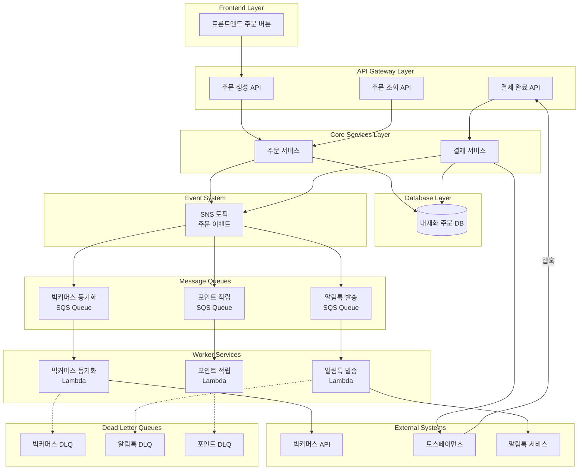

## 🔄 주문 처리 플로우

### 1. 주문 생성 플로우

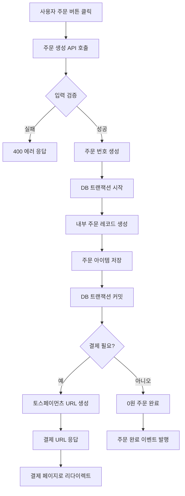

### 2. 결제 완료 처리 플로우

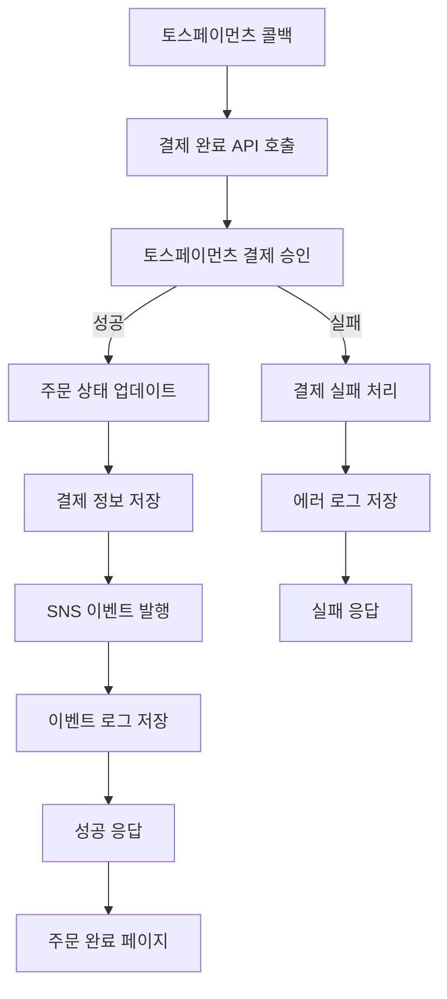

## 📡 SNS-SQS 이벤트 시스템

### SNS 토픽 구조

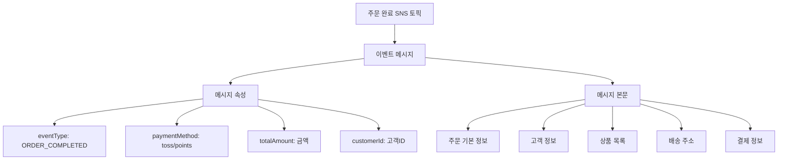

### SQS 구독 및 필터링

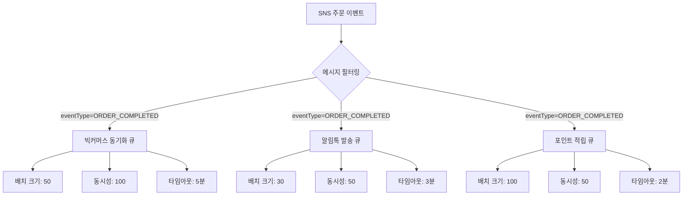

## 🔧 워커 서비스 처리 플로우

### 빅커머스 동기화 워커

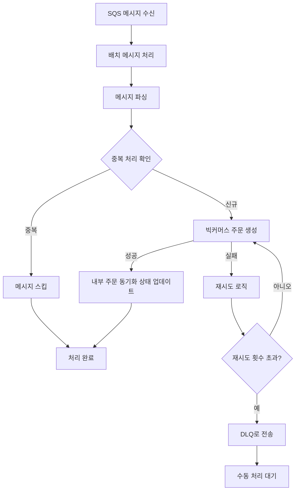

### 알림톡 발송 워커

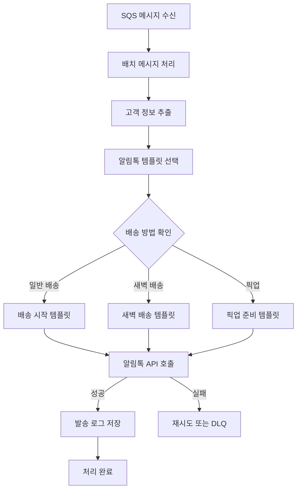

## 🔍 모니터링 및 알림 시스템

### CloudWatch 메트릭 대시보드

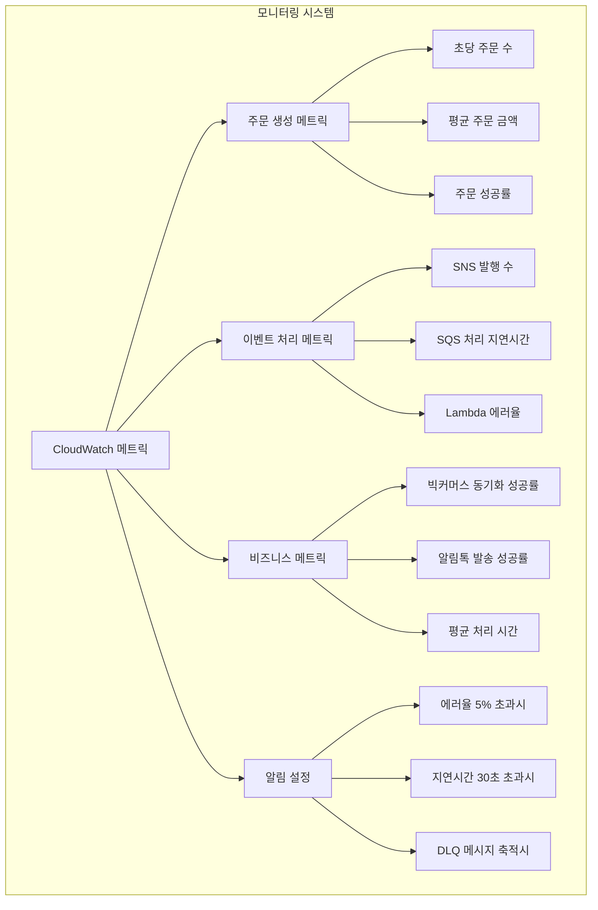

### 장애 대응 플로우

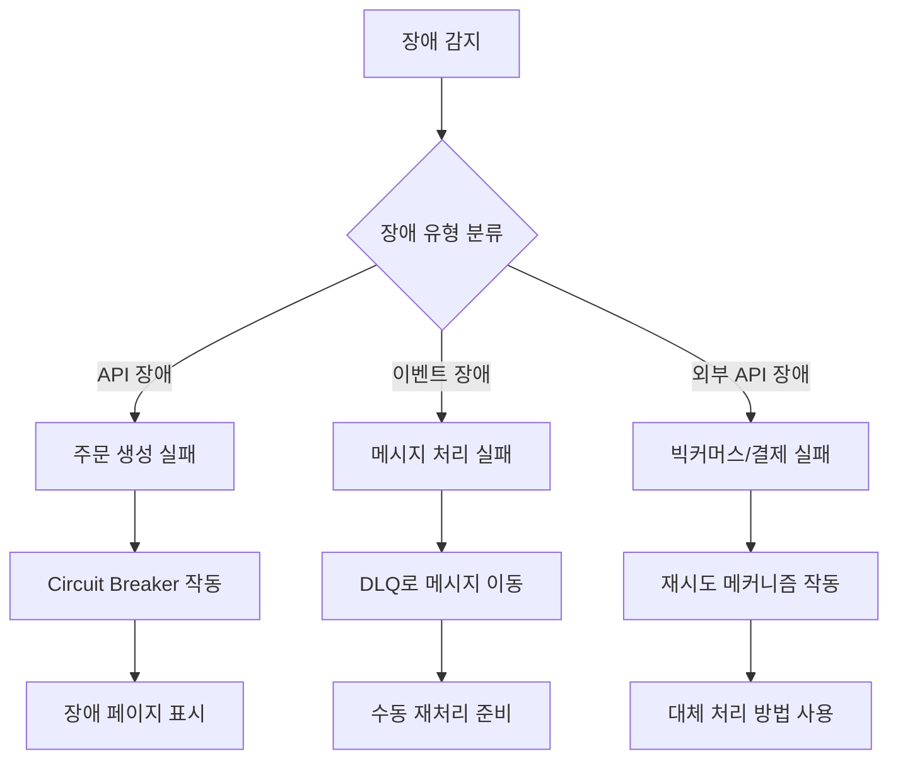

<!--
## 🚀 단계별 마이그레이션 로드맵

### Phase 1: 기반 구축 (4주)

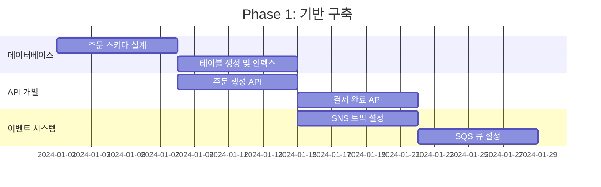

### Phase 2: 워커 개발 (4주)

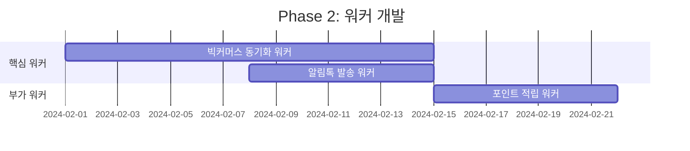

### Phase 3: 프론트엔드 전환 (2주)

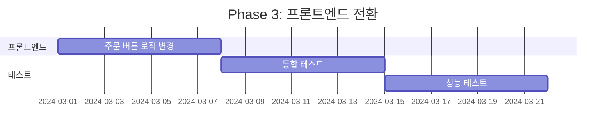

## 📈 예상 성능 및 효과

### 처리량 비교
-->
