# 빅커머스 의존성 분리 및 주문 시스템 내재화 아키텍처 설계

## 📋 개요

현재 빅커머스에 완전히 의존하고 있는 주문 시스템을 점진적으로 분리하여 100% 내재화를 목표로 하는 아키텍처 설계입니다.

**기본 전략:**

- 프론트엔드 주문 로직을 내재화된 API로 변경
- PG사 결제 프로세스 완전 분리 (결제 검증 필수)
- SNS-SQS 팬아웃 패턴으로 높은 처리량 확보
- 이벤트 기반 아키텍처로 빅커머스 동기화 및 후속 처리 분리
- 점진적 마이그레이션으로 리스크 최소화

**결제 보안 강화:**

- 프론트엔드 결제 완료 후 백엔드에서 반드시 PG사 검증
- 결제 금액/정보 불일치 시 자동 취소 처리
- 위조 결제 데이터 감지 및 차단
- 웹훅을 통한 이중 검증 체계

## 🏗️ 전체 시스템 아키텍처

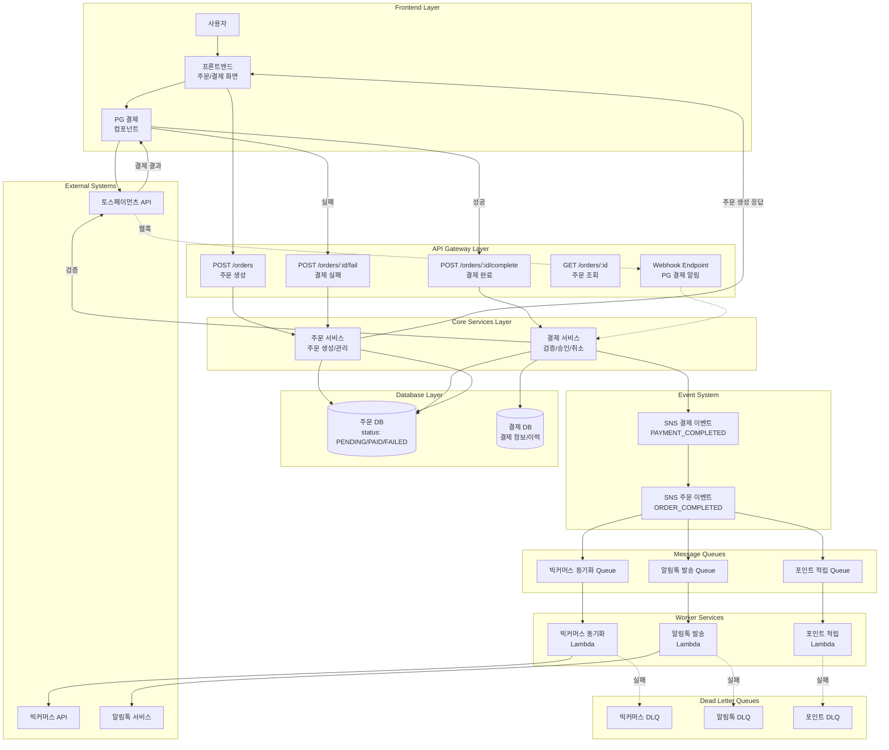

## 🔄 주문 처리 플로우

### 1. 주문 생성 플로우

```mermaid
flowchart TD
    A[사용자 주문 버튼 클릭] --> B[주문 생성 API 호출<br/>POST /orders]
    B --> C{입력 검증}
    C -->|실패| D[400 에러 응답]
    C -->|성공| E[주문 번호 생성]
    E --> F[DB 트랜잭션 시작]
    F --> G[주문 레코드 생성<br/>status: PENDING]
    G --> H[주문 아이템 저장]
    H --> I[배송 정보 저장]
    I --> J[DB 트랜잭션 커밋]
    J --> K{결제 필요?}
    K -->|예| L[결제 정보 준비<br/>(주문ID, 금액, 상품명)]
    K -->|아니오| M[0원 주문 완료<br/>status: PAID]
    L --> N[주문 생성 응답<br/>(주문ID, 결제정보)]
    M --> O[주문 완료 이벤트 발행]
    N --> P[프론트엔드에서<br/>PG 결제 진행]
    O --> Q[주문 완료 응답]

```

### 2. 결제 플로우 (상세)

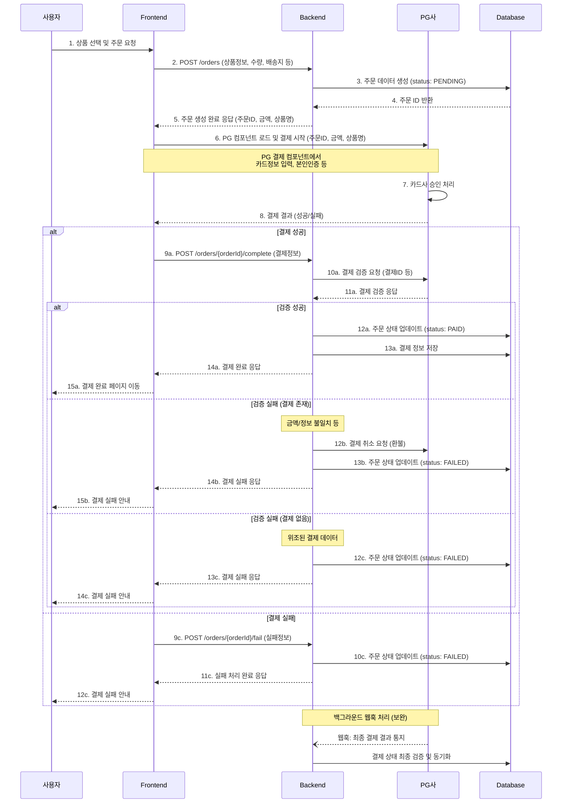

### 3. 결제 완료 처리 플로우 (간략)

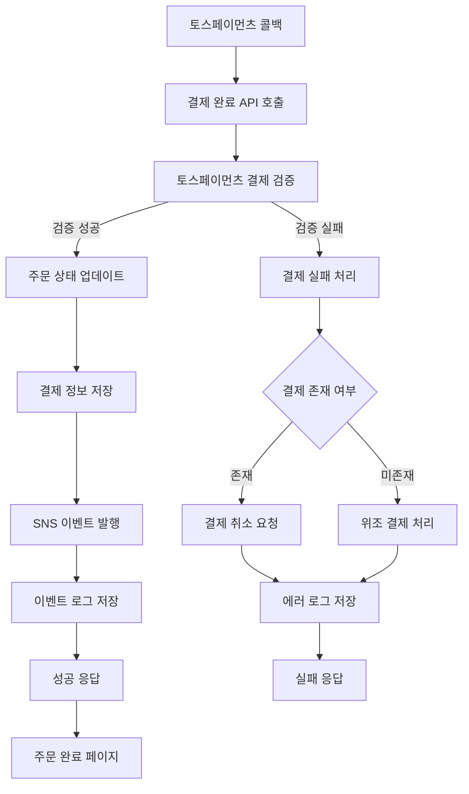

## 📡 SNS-SQS 이벤트 시스템

### SNS 토픽 구조

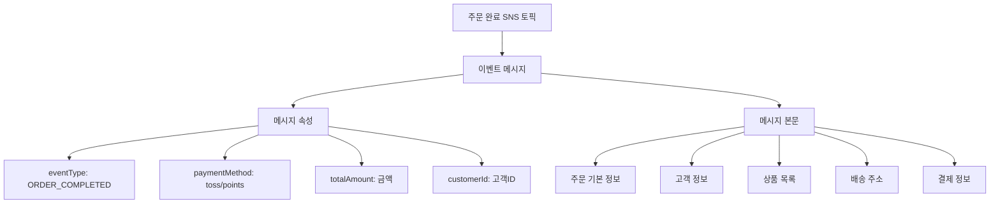

### SQS 구독 및 필터링

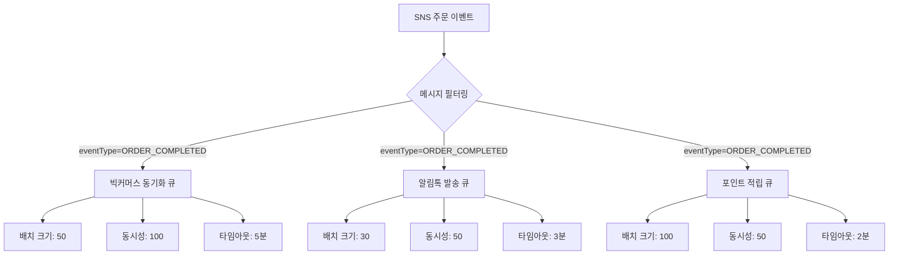

## 🔧 워커 서비스 처리 플로우

### 빅커머스 동기화 워커

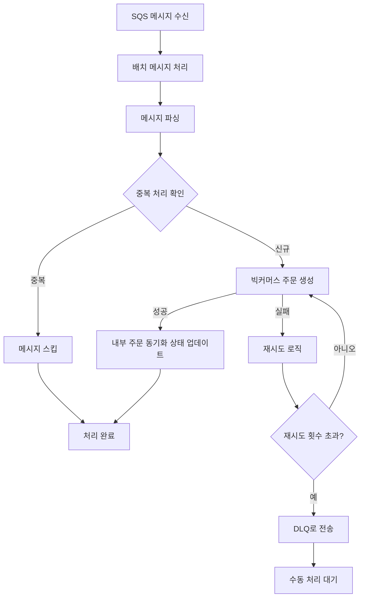

### 알림톡 발송 워커

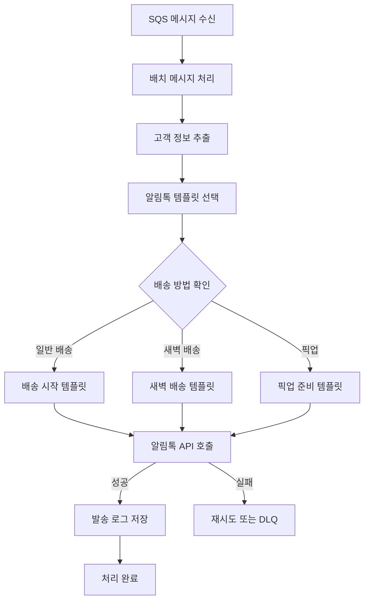

## 🔍 모니터링 및 알림 시스템

### CloudWatch 메트릭 대시보드

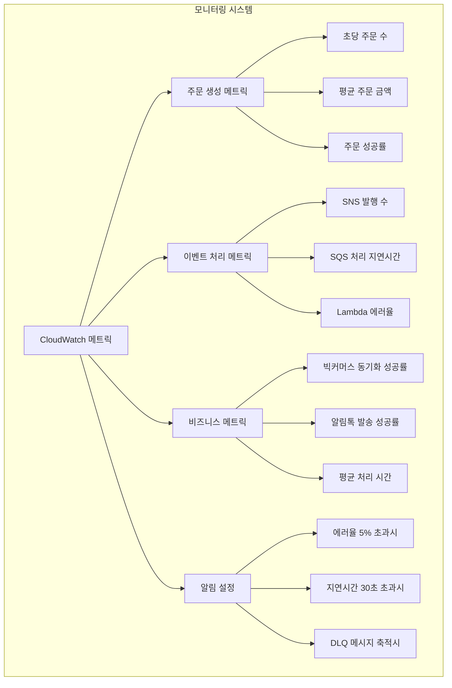

### 장애 대응 플로우

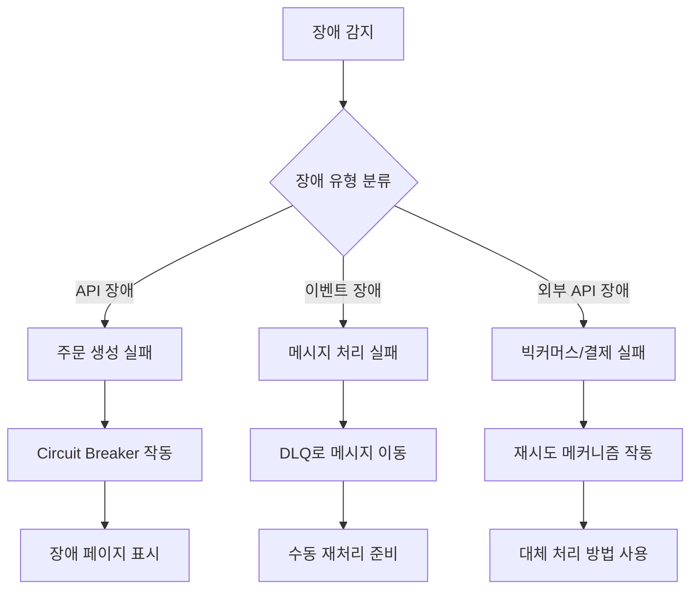

<!--
## 🚀 단계별 마이그레이션 로드맵

### Phase 1: 기반 구축 (4주)

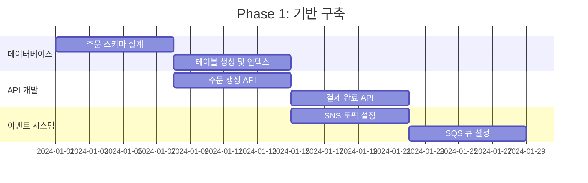

### Phase 2: 워커 개발 (4주)

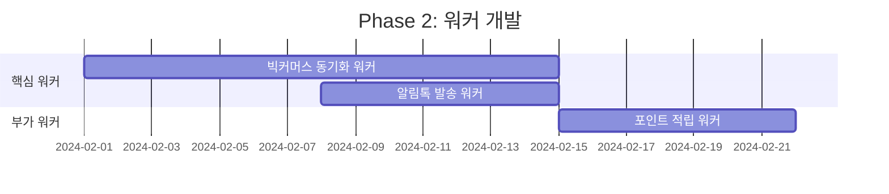

### Phase 3: 프론트엔드 전환 (2주)

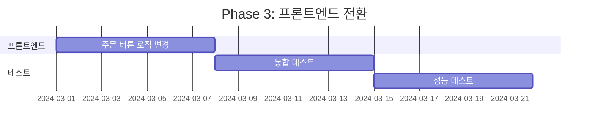

## 📈 예상 성능 및 효과

### 처리량 비교
-->
