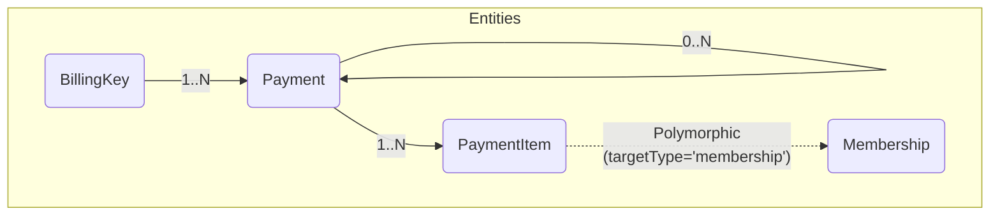

# Payment 엔티티

## 1. 엔티티 관계 다이어그램 (ERD)



## 2. 주요 엔티티 관계 설명

- **Payment ↔ BillingKey (Many to One)**

  - 하나의 `BillingKey`는 여러 개의 `Payment`(결제)를 생성할 수 있습니다.
  - 멤버십 정기결제와 같이 동일한 결제 수단을 반복적으로 사용할 때 사용됩니다.

- **Payment ↔ PaymentItem (One to Many)**

  - 하나의 `Payment`는 여러 개의 `PaymentItem`을 가질 수 있습니다.
  - 예를 들어, 한 번의 결제로 여러 멤버십 상품을 구매하는 경우 (합배송), 각 상품이 `PaymentItem`으로 기록됩니다.

- **Payment ↔ Payment (Self-referencing, One to Many)**
  - 결제를 취소하거나 환불할 때 사용되는 관계입니다.
  - 새로운 `Payment` 엔티티가 생성되고(보통 음수 금액으로), `originalId` 필드를 통해 원본 `Payment`를 참조합니다. 이를 통해 어떤 결제 건에 대한 취소/환불인지 추적할 수 있습니다.

## 3. 모델링 패턴: Polymorphic Association (다형적 연관 관계)

`PaymentItem`에서 `targetType`과 `targetId`를 사용하여 연관 대상을 관리하는 방식은 **다형적 연관 관계(Polymorphic Association)** 라고 불리는 모델링 패턴입니다.

### 3.1 사용 이유

- **유연성 및 확장성**: `PaymentItem`이 `Membership`뿐만 아니라 `Order` 등 내재화하며 추가될 수 있는 다양한 모델과 관계를 맺어야 할 때, 각 객체에 대한 별도의 연결 테이블(e.g., `payment_membership_items`, `payment_order_items`)을 만들 필요가 없음 `targetType`에 대상 테이블의 이름을, `targetId`에 해당 레코드의 ID를 저장함으로써 하나의 `PaymentItem` 테이블로 여러 종류의 연관 관계를 표현할 수 있습니다. 간단한 테이블 구조로 시스템의 확장성을 확보할 수 있음.

- **단순한 구조**: 여러 연결 테이블을 관리하는 대신, 하나의 테이블(`payment_item`)만 유지하면 되므로 데이터베이스 스키마와 애플리케이션 로직이 단순해집니다.

- **단점**: 이 패턴은 데이터베이스 레벨에서 외래 키 제약 조건(Foreign Key Constraint)을 통한 데이터 무결성을 강제할 수 없다는 단점이 있습니다. 애플리케이션 레벨에서 `targetType`과 `targetId`의 유효성을 검증하는 로직이 반드시 필요합니다.

## 4. 데이터베이스 스키마 (DDL)

### 4.1 payment 테이블

```sql
CREATE TABLE "payment" (
  "id" serial primary key,
  "created_at" timestamptz not null,
  "updated_at" timestamptz not null,
  "customer_id" int not null, -- 빅커머스 customer_id
  "amount" numeric(10,2) not null, -- 금액
  "currency" text not null default 'KRW',
  "status" text not null, -- 결제 상태
  "payment_method" text not null, -- xpay or brandpay
  "payment_gateway" text not null default '', -- pg 사 이름 (toss), 추후 다른 pg를 쓸수도 있으니..
  "gateway_transaction_id" text not null, -- pg 에서 반환하는 결제 식별 키
  "gateway_response" jsonb not null default '{}', -- pg 사에서 결제시 반환하는 응답 객체 자체 (일부 정보는 제외), 감사 로깅용
  "billing_key_id" int null, -- 빌링키 외래키
  "payment_reason" text not null default 'manual', -- initial, renewal
  "notes" text not null default '',
  "original_id" int null -- 원본 결제 참조 키, 취소나 환불 시 참조용
);
```

### 4.2 payment_item 테이블

```sql
CREATE TABLE "payment_item" (
  "id" serial primary key,
  "created_at" timestamptz not null,
  "updated_at" timestamptz not null,
  "payment_id" int not null,
  "target_type" text not null, -- Order, Membership 등
  "target_id" int not null
);
```

## 5. 주요 고려사항

### 5.1 결제 상태 관리

- **PENDING**: 결제 요청 후 승인 대기 상태
- **COMPLETED**: 결제 완료 상태
- **FAILED**: 결제 실패 상태
- **REFUNDED**: 환불 완료 상태 (음수 금액으로 기록)
- **CANCELLED**: 취소 완료 상태 (음수 금액으로 기록)

### 5.2 취소/환불 처리

- 취소/환불 시 새로운 Payment 엔티티를 생성합니다.
- 원본 결제와 `original` 관계로 연결합니다.
- 금액은 음수로 기록하여 정산 시 차감 처리합니다.

### 5.3 PaymentItem 활용

- 하나의 결제로 여러 멤버십을 처리할 수 있습니다.
- `targetType`과 `targetId`로 결제 대상을 식별합니다.
- 멤버십의 경우 `targetType: 'membership'`, `targetId: membership.id`로 저장됩니다.

### 5.4 BillingKey 관계

- 멤버십 구독의 경우 동일한 BillingKey로 정기 결제가 이루어집니다.
- BillingKey가 삭제되면 해당 고객의 결제 수단 정보가 손실될 수 있으므로 주의해야 합니다.
- `selectedAt` 필드를 통해 현재 고객이 선택한 대표 결제 수단을 관리합니다.
